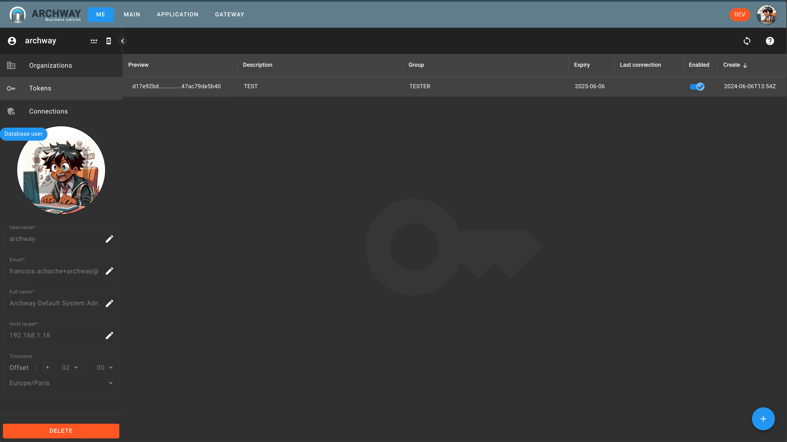

Tokens allow you to authenticate yourself to the API.

Generally, you log in to the application managed by `ARCHWAY` via the browser.

However, sometimes it is necessary to authenticate from another application to make an API call, for example.

In this case, using a token is necessary.

This screen allows you to manage your own tokens.

Tokens are personal and inherit the rights of the current user within the current organization.

When creating a token, depending on the group management mode, you may need to associate a group.

Indeed, organizations can manage groups in 2 different ways. See: [Group Mode](/doc/organization/configuration#group-mode)

- `MULTIPLE`: If multiple groups are associated with the user, the user will have all the roles of the associated groups.
- `SINGLE`: If multiple groups are associated with the user, the user must choose which group to authenticate with and therefore with which roles.

Also, depending on the group management mode, you may need to associate a group when creating a token.

## Create a token

To create a token, use the floating action button (fab-button) located at the bottom right of the screen and follow the instructions provided.

import Multi from './img/create-token-multi.png';
import Single from './img/create-token-single.png';

After creating the token, the interface displays it. Note that the token generated is no longer visible after creation.

import TokenCreated from './img/token-created.png';

## Manage tokens

You can then use the dashboard to manage your tokens.

 - Disable: make the token invalid
 - Delete: delete the token

