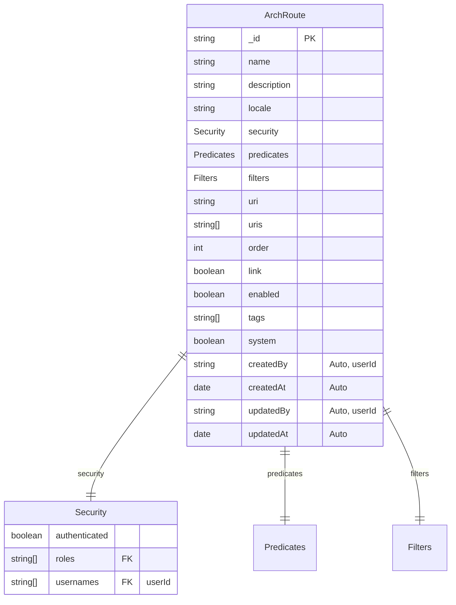
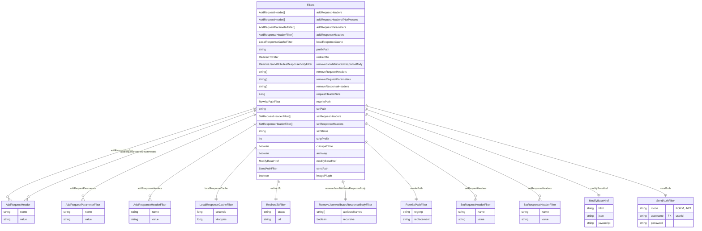
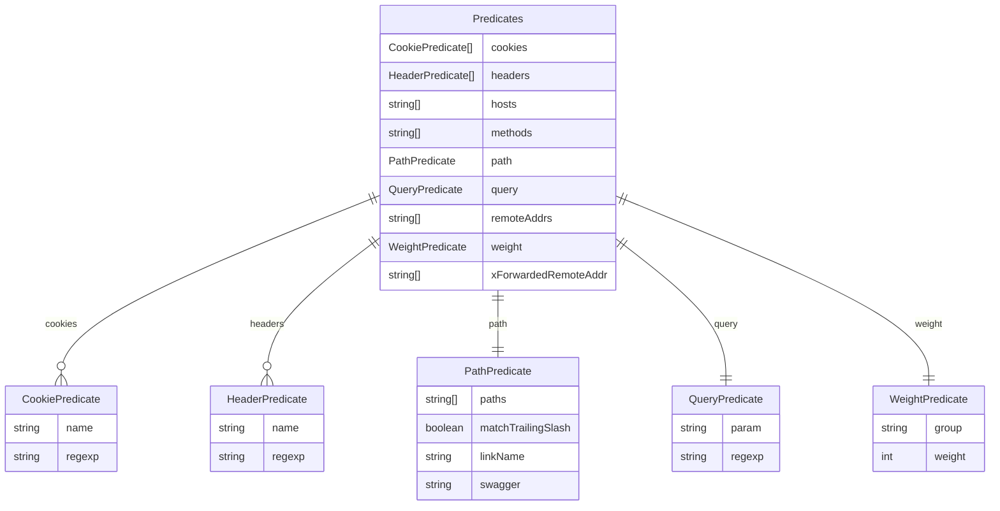
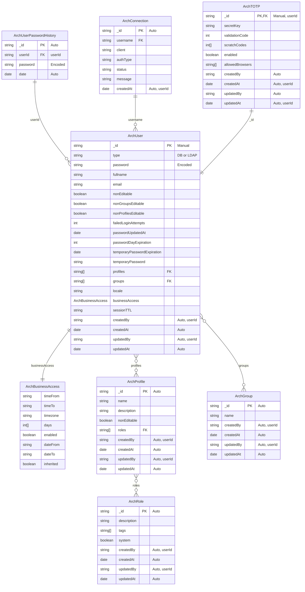
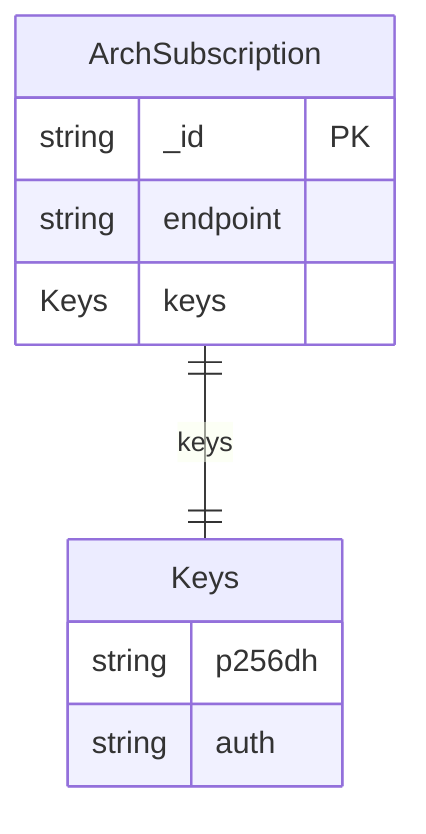
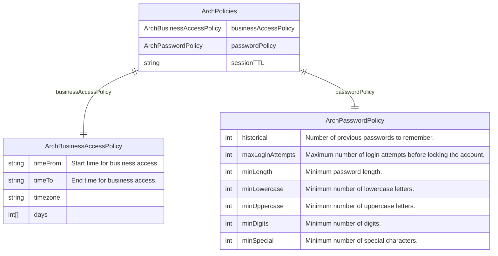
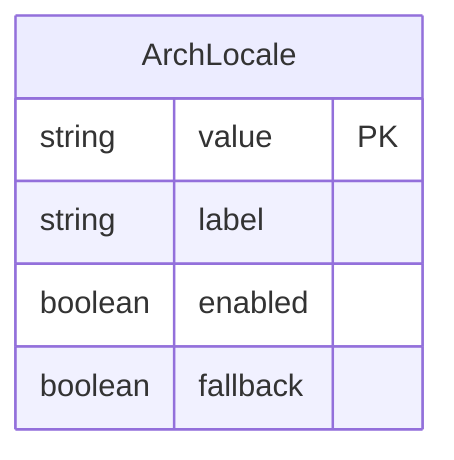
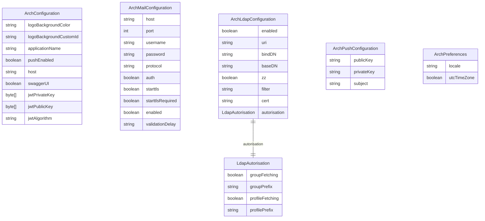
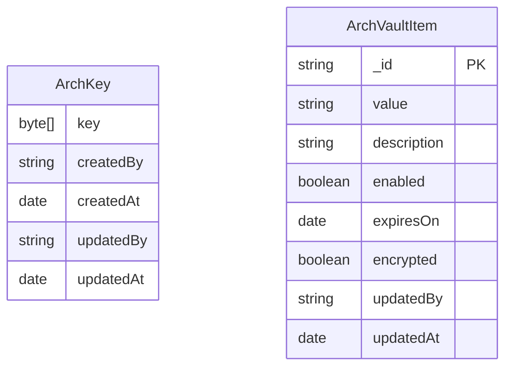

`ARCHWAY` est construit sur des technologies éprouvées.

## `Back-end`

La partie `back-end` s'appuie sur l'écosysteme `Spring`. Et plus particulierement `Spring cloud gateway`.

`Spring Cloud Gateway` est une `API gateway` dynamique pour microservices.
Il est construit sur `Spring Framework` et `Spring Boot`, offrant une manière facile de créer le routage d'`APIs`.
`Spring Cloud Gateway` est souvent utilisé dans les architectures basées sur les microservices pour gérer efficacement les requêtes entre les différents services.

## `Front-end`

La partie `front-end`, elle, s'appuie sur l'écosysteme `Angular`.  `Angular` et `Material Angular` sont utiliser principalement dans l'interface utilisateur. Avec d'autres `Framework` ou librairies comme `Fontawesome` ou `Echartjs`.

`Angular` est un framework de développement front-end basé sur TypeScript, développé et maintenu par `Google`.

`Angular Material` est une bibliothèque de composants `UI` pour `Angular`, suivant les principes du `Material Design` de `Google`.

## `Database`

Pour la base de donné nous avons choisi `MongoDB`.

`MongoDB` est une base de données `NoSQL` orientée documents, très populaire pour sa flexibilité et ses performances.

## Schemas

### Routes

### Route Filters

### Route Predicates

### User

### Push

### Application configuraiton

### Configurations

### Vault

