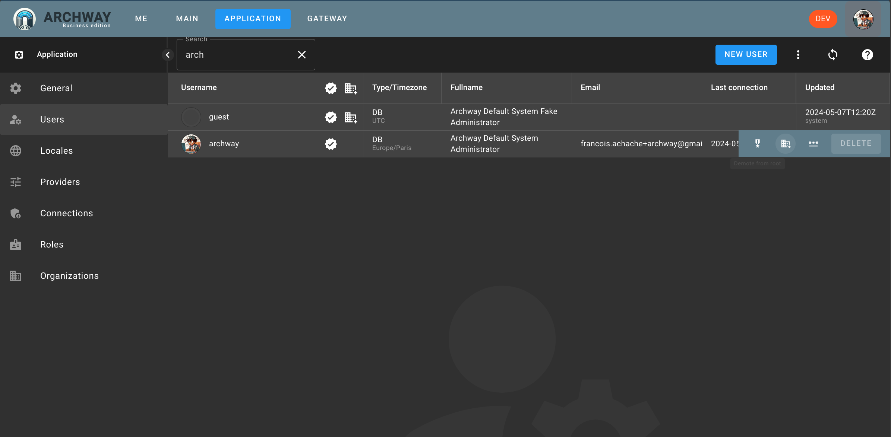

## Allow organization creation

The first step after creating the system user is to grant them the right to create organizations.

To do this, once logged in, go to the `APPLICATION` page, then select `Users`.

On the line of the user you created, allow them to create organizations by clicking on the `Allow organization creation` button.

## Create organization

Then go to the `ME` page.

Click on the `NEW ORGANIZATION` button.

Enter the name of the organization. For example, we will name it `MAIN`;

There you have it, you now have an organization.

:::note
If the concept of an organization is not important in your case, create only one.
:::

## Go to the organization

Go to the `ME` page and on the line for the organization `MAIN`, click on the `GO TO` button.

