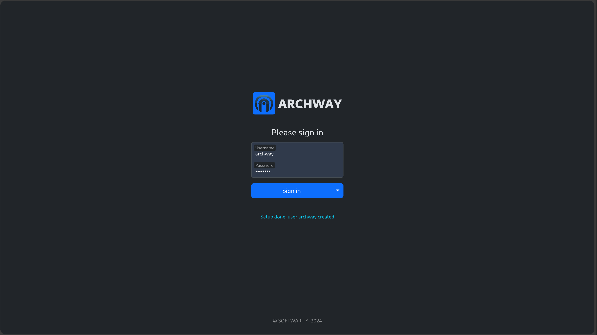

:::note
La facon la plus simple d'installer `ARCHWAY` est via `docker compose`.
:::

## Fichier `docker-compose.yml`

<details>
  <summary>`docker-compose.yml`</summary>
```yml title="docker-compose.yml"
version: '3.8'
services:
  archway:
    image: ghcr.io/hhdevelopment/archway:latest
    ports:
      - 8080:8080 # non HTTPS
    environment:
      MONGODB_HOST: mongodb 
      MONGODB_DB_NAME: archway
      MONGODB_USER: admin
      MONGODB_PWD: changeit

  mongodb:
    image: mongo # official image  
    environment:
      MONGO_INITDB_DATABASE: archway
      MONGO_INITDB_ROOT_USERNAME: admin
      MONGO_INITDB_ROOT_PASSWORD: changeit
```
</details>

## Démarrage du projet

```bash
docker compose -f docker-compose.yml pull
docker compose -f docker-compose.yml up -d
```

## Setup

Aprés avoir lancé l'application, `ARCHWAY` va s'auto-initialiser.

Mais il nécessite de configurer l'utilisateur d'administrateur.

<a target="_blank" href="http://localhost:8080">ARCHWAY SETUP</a>


## Connextion

