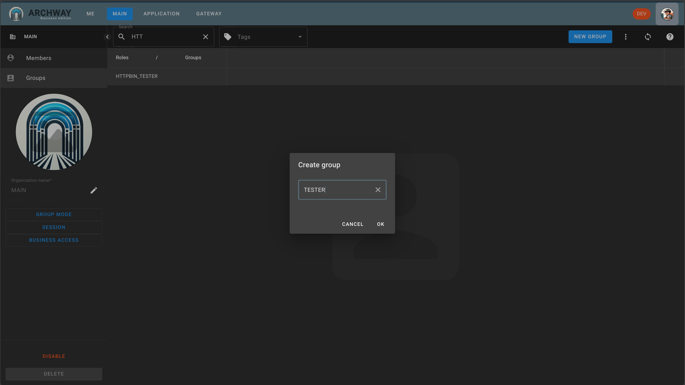
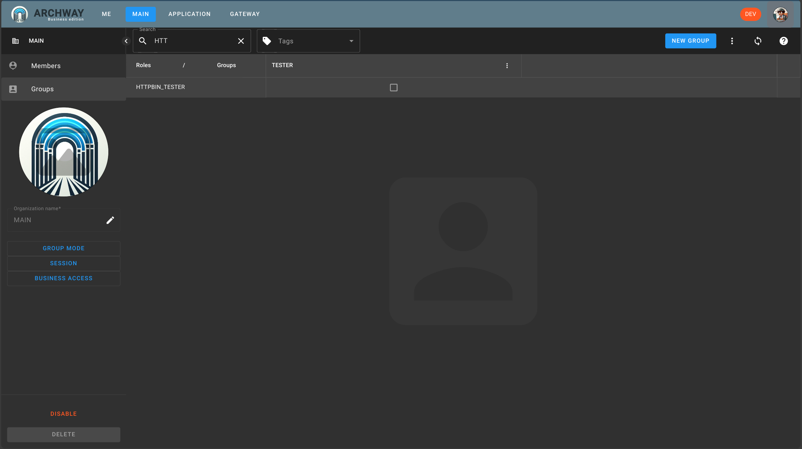

At this stage we have:

 - a role: `HTTPBIN_TESTER`
 - a route: `httpbin` secured by this role.
 - an organization: `MAIN`
 - And we are inside it

We now need to create a group with the role `HTTPBIN_TESTER`.

And to be in this group.

Go to the `MAIN` page which allows you to administer the organization.

Then select the `Groups` section.

Finally, click on the `NEW GROUP` button. Create the group `TESTER`.

And finally check the checkbox between `HTTPBIN_TESTER` and `TESTER`.

