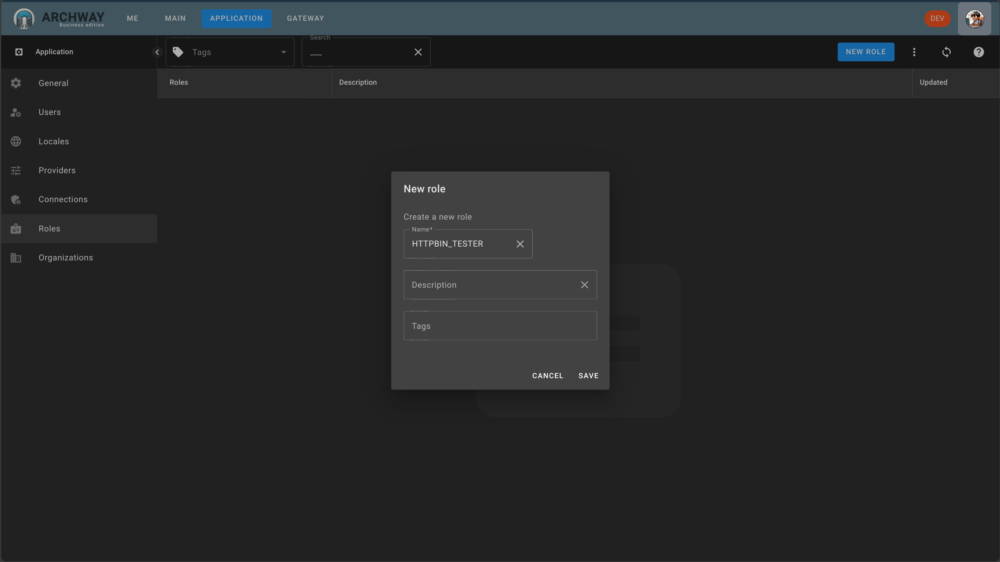

Before creating the route, we will create a role to access it.

:::note
In our case, we will use this role to secure the route. However, it is of course possible to use this role to secure the endpoint directly in the target application. To do this, we will enable the transmission of authentication and authorization in the target application.
:::

Go to the `APPLICATION` page, then select the `ROLES` section.

Click on `NEW ROLE`

Name the role: `HTTPBIN_TESTER`, then save.

This role will allow us to secure the route.
