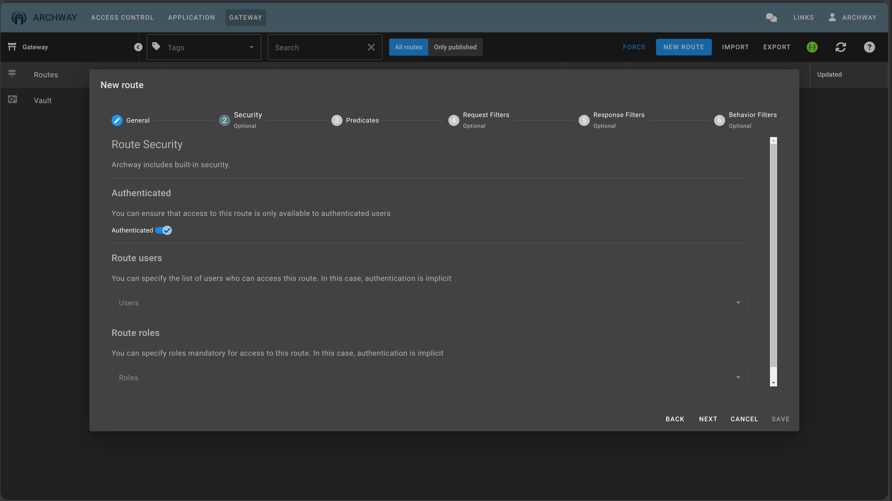

## Sécurisation de la route

En plus d'un filtre de requêtes permettant de transmettre des informations liées à l'utilisateur courant, `ARCHWAY` permet de définir simplement qui peut accéder à la route.

:::tip
3 niveaux de sécurisation
  - Seuls les utilisateurs authentifiés peuvent accéder à la route.
  - Seuls les utilisateurs listés peuvent accéder à la route
  - Seuls les utilisateurs possédant au moins un des rôles listés peuvent accéder à la route
:::

Pour `httpbin` nous voulons que seuls les utilisateurs authentifiés peuvent y accéder.

