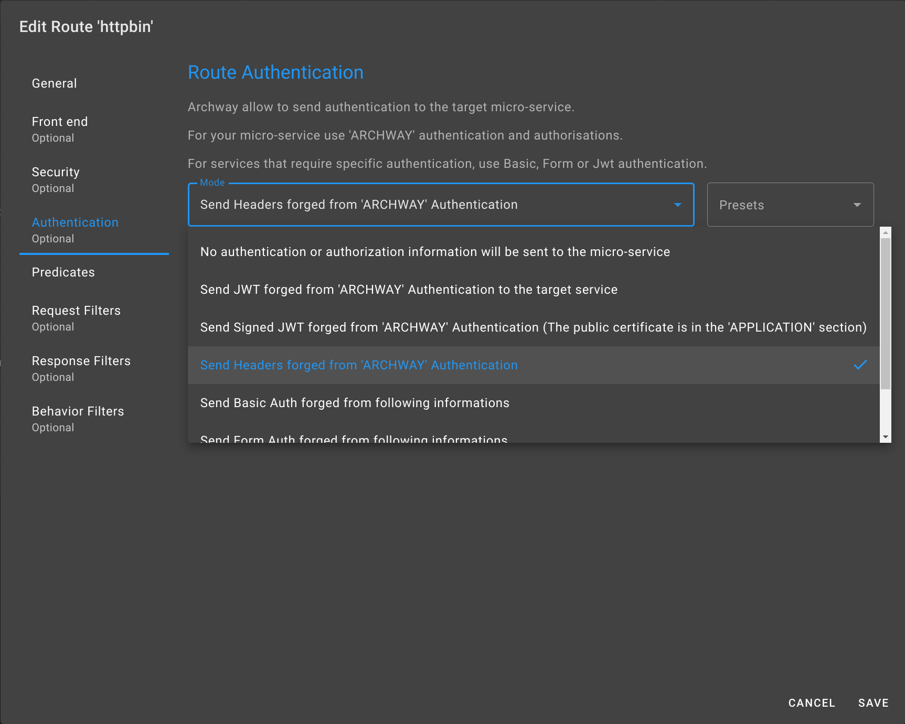

In the previous chapter, we secured the route.

Regardless of the level of route security, it is interesting to send user information to the microservice so that it can be used for security purposes as well as for business reasons.

In our example, we will ask `ARCHWAY` to transmit this information in the `HTTP` headers.

Go to the `Authentication` section, then select `Send Headers forged from 'ARCHWAY' Authentication`.

