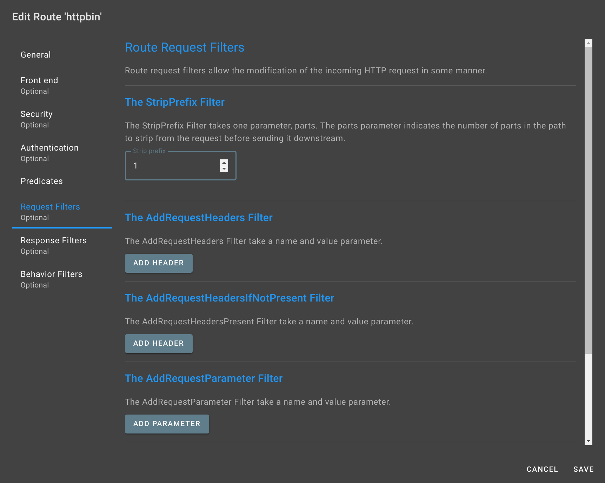

:::danger
Be careful, this step should not be done if you have perfectly followed the previous steps.
Only in the case where you have defined a route predicate different from `/**`.
:::

We have defined the route predicate as `/**`.

In our case, it is not necessary to define a request filter. You can skip this step.

## Path prefix

However, if we had defined a route path different from `/**`, it would be necessary to define a request filter.

Imagine that we had defined the route path `/httpbin/**`.

This means that if I did:

```bash
curl http://localhost:8080/httpbin/get
```

I would expect it to respond in the same way as if I did:

```bash
curl http://httpbin.org/get
```

But in the current state, this is what would be executed.

```bash
curl http://httpbin.org/httpbin/get
```

This is not what we want.

## Strip prefix

To fix this, we would need to add a request filter that will remove the prefix that allowed us to condition the route.

To do this, we would use the `stripPrefix` filter with a value of 1 (removal of one element).


