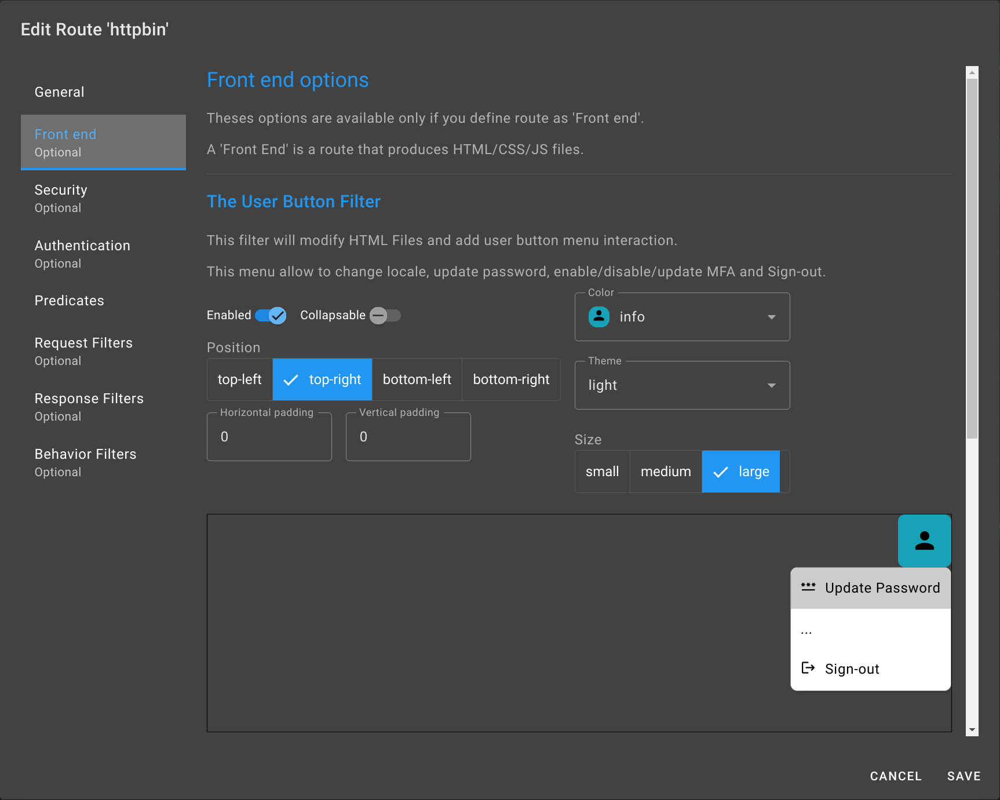

:::info
The route must be set as `Frontend` to access these options.
:::

After setting the general parameters in the previous section, go to the `Frontend` section.

Activate the `User Button`.

Select:

 - Position: `top-right`.
 - Color: `info`
 - Theme: `light`
 - Size: `large`

This will add a button to the user interface of httpbin.

 :::note
Adjust the size, position, color, theme, and size of the button as needed.
 :::

