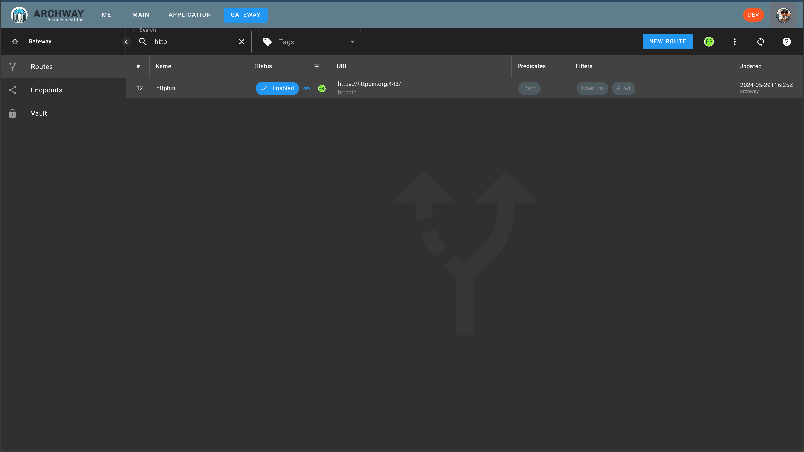

We can now save the route and activate it.

After saving the route, the editing window closes.

A line appears in the route list.

Click on the dot in the `Status` column so that the dot displays `Enabled` in blue.

:::tip
If at the time of activating a route, another route with the same predicate exists, the latter will be automatically deactivated.
:::

:::note
By default, routes are created disabled.
This is for two reasons:
 - It allows the creation of multiple routes with the same predicate and to choose which one to activate.
 - It prevents the accidental deactivation of a route with the same predicate.
:::
