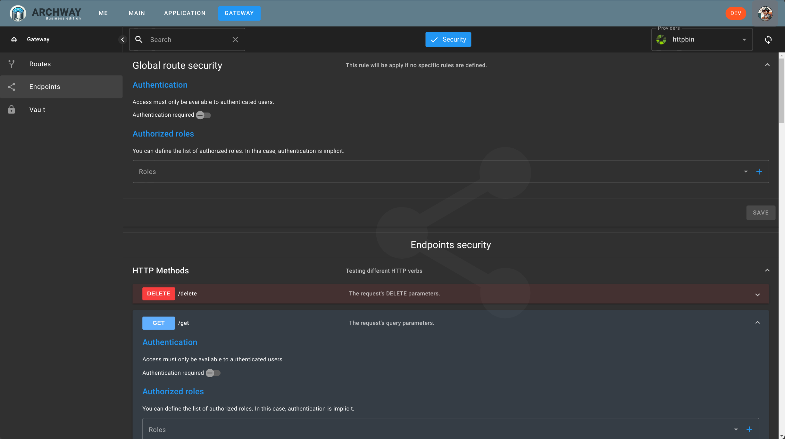

In this section, we will see how to simply secure the route.

:::info
Here we will secure the route directly, but we could also secure the `endpoint`. Thus, managing it in a much more precise way.
:::

Securing the route is possible in two ways:

  - Only authenticated users can access the route.
  - Only users possessing at least one of the listed roles can access the route.
  
For `httpbin`, we want only users possessing the previously created role to have access.

## Endpoint Security

:::tip
Since `httpbin` exposes an `open-api` specification file, we could define security at the `endpoints` level.
:::

