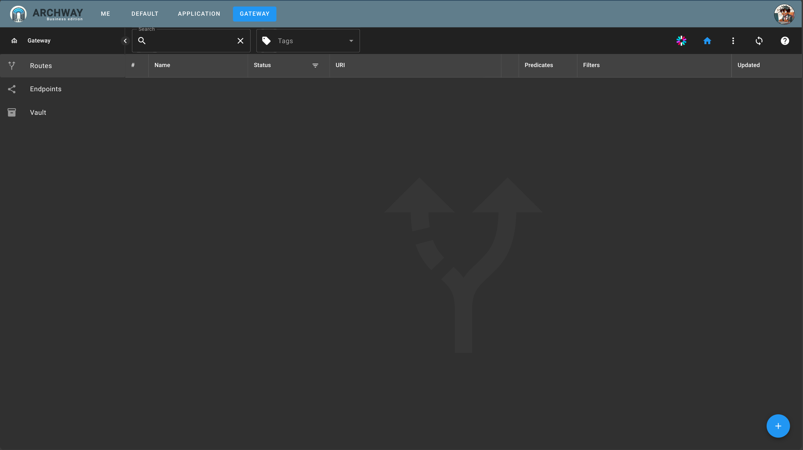

We are going to create a route to the `httpbin` site.

:::note
`httpbin` is a simple online service that returns the `HTTP` data it receives, such as requests and headers. It is often used to test HTTP clients and libraries, as it allows you to see exactly what data is sent and how it is received.
The advantage here is that httpbin exposes both a frontend and APIs.
:::

## Creation

Click on the `Gateway` tab

Then click `NEW ROUTE`

Enter a name, description, URI and openapi spec for the route.

 - name: httpbin
 - description: httpbin
 - uri: https://httpbin.org:443
 - open-api: spec.json

**Then select `Frontend`**

 :::note
 Setting the route as frontend (UI) activates options related to frontends.
 For example, the User Button.
 :::

Httpbin exposes an OpenAPI specification on the path `spec.json`.

Enter the path `spec.json` in the open-api field.

:::note
When OpenAPI specifications are provided, `ARCHWAY` allows for finely securing the route for each endpoint.
Additionally, a swagger-ui interface is available to test the endpoints (APIs).
:::

