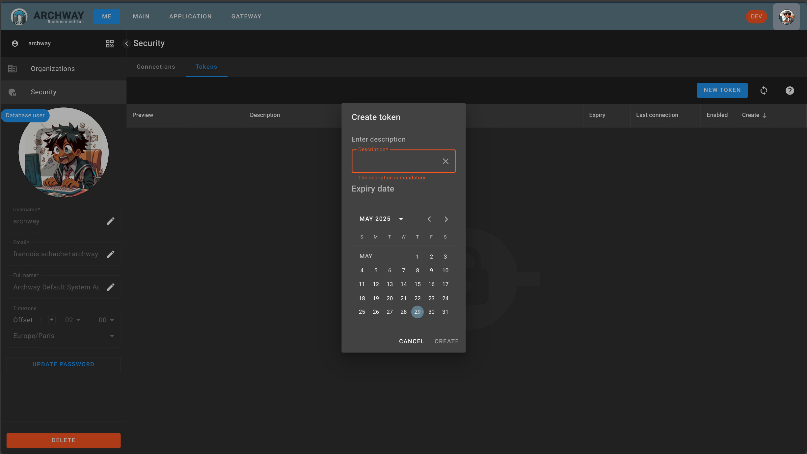
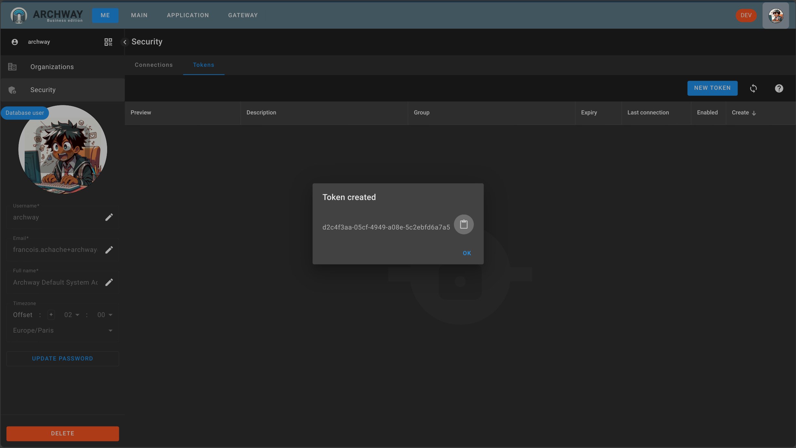

To cover as many cases as possible, we will now create a connection token, which also allows testing access to the route via an API call (without going through a graphical interface).

For this, we will use the token to authenticate and obtain a JWT ticket.

Go to the `ME` page. Section `Security`, then `Tokens`.

Click on the `NEW TOKEN` button.

Enter the description of the token, then click `CREATE`.

In return, a window opens and reveals the token.

Copy the token, it will be used later in the tutorial.

:::note
The token will not be accessible later, make sure to save it.
:::
